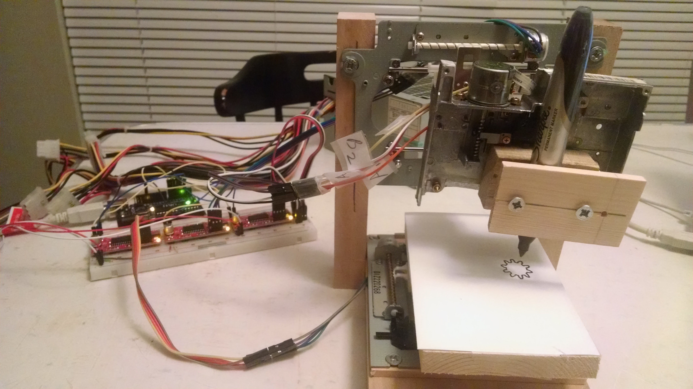
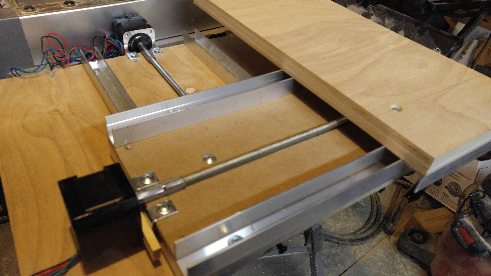

In an effort to better understand how CNC Routers work, I decided to build one
from scratch. Having little confidence that I could pull it off, I came up with
a plan to break this ambitious project up into a series of smaller wins.

The first step was to build a CNC mostly out of reclaimed electronics. I learned
that the motors in many cd rom drives are stepper motors, so I took apart some
old computers I had access to. For this build, I only needed to purchase 3
stepper motor drivers and an Arduino. For less than $50 I proved that I am able
to build such a device.

With this success, I had the confidence to buy some NEMA 17 motors (at about $15
a piece) and scale the build up. This build worked mostly fine, but the motors
would occasionally stick. I got the feeling my naive design was to blame. About
that time, I had purchased a 3D Printer and decided to put it to work for me.

A little research revealed the
[MaduixaCNC](https://www.thingiverse.com/thing:989593). It's an open source
design based on a handful of 3d printed parts coupled with fairly accessible
hardware. While not perfect, this design strikes me as a fairly nice jumping off
point if you wanted to make your own CNC.

In the end, I built a CNC over the course of a year for a little over $200. If
you simply want to have a CNC, this may not be the most practical way to get
there. It was, however a very rewarding journey. One that I'd recommend to
anyone who wants to learn about how CNCs work.

<iframe
  src="https://www.youtube.com/embed/TWuP_DbFSsA"
  frameborder="0"
  allow="autoplay; encrypted-media"
  allowfullscreen=""
  id="fitvid2"></iframe>
