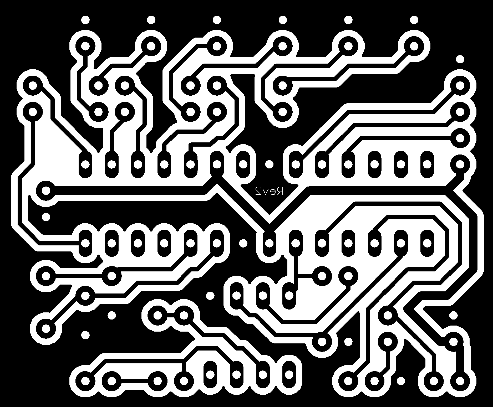
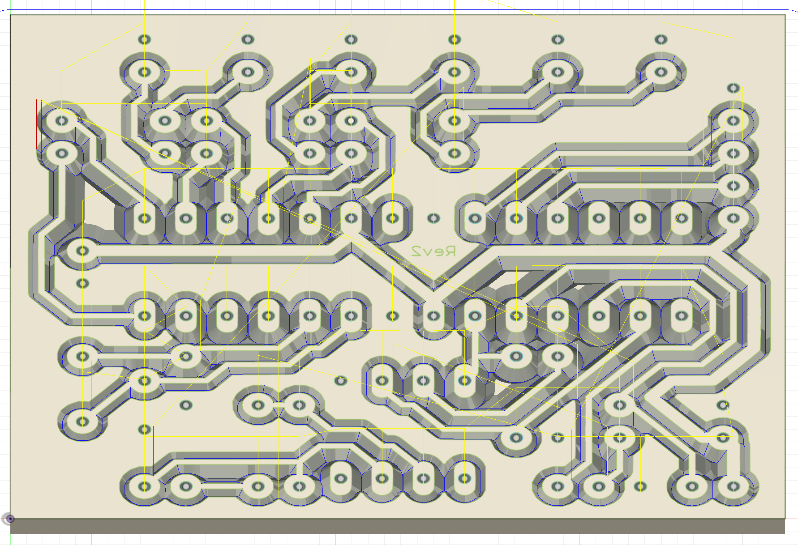
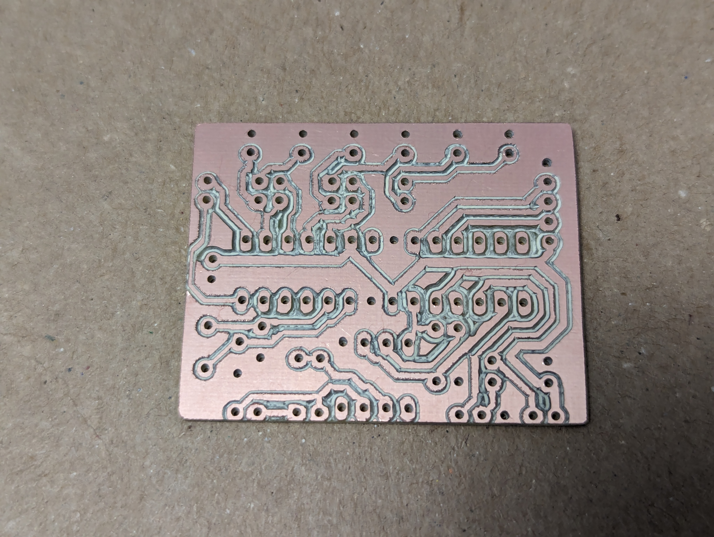
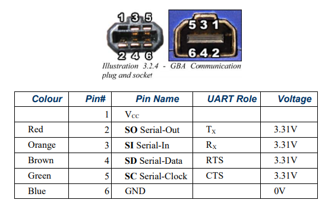
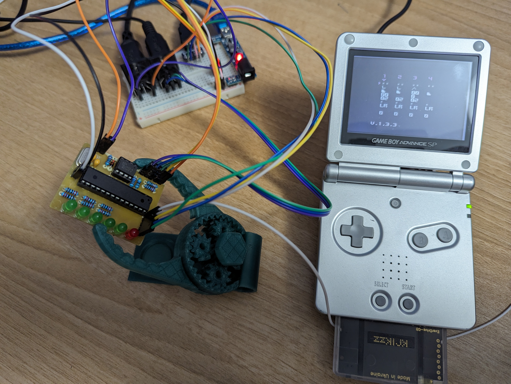
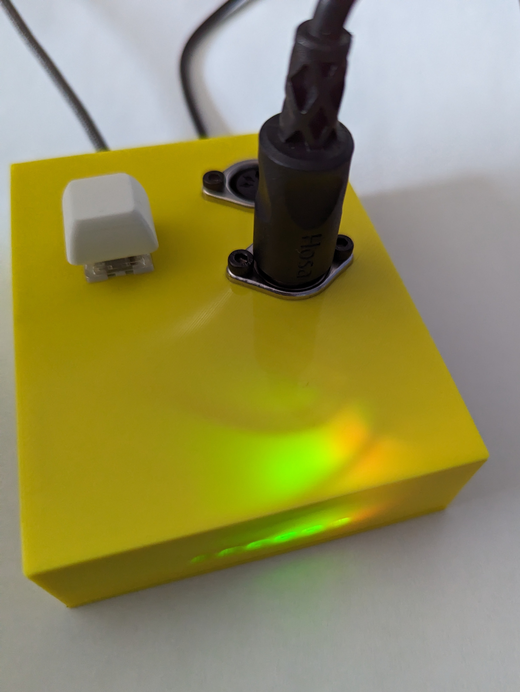

I've been enjoying LSDJ recently and building an
[Arduinoboy](https://github.com/trash80/Arduinoboy) was the next "logical" step.
I've also been itching for an excuse to mill a PCB on my CNC. This felt like a
project that was just complicated enough that I'd benefit from the new-to-me
technique.

## On the shoulders of giants

I stumbled upon a schematic in this [forum
post](https://chipmusic.org/forums/post/202844/#p202844) by way of [this blog
post](https://gr33nonline.wordpress.com/2019/04/06/making-your-own-arduinoboy/).
While a PNG is not the most convenient way to express a circuit, I'm glad to have
found it.

I opened the PNG in inkscape and traced it as a vector. From there, I
exported an SVG to import into Fusion 360. As you convert images from one format
to another be sure you don't drift away from the desired board dimensions.
You're targeting a board with the dimensions of 1.875" x 1.55".

## Millin' time

Once I had that sorted out, I sent it over to my [MPCNC](/note/mpcnc) for
milling.

## Time to solder

Following this image, I soldered it up. Some people cut open the link cable and
solder that directly. I didn't want to sacrifice the cable as a consumable so I
ordered up a [breakout PCB](https://github.com/Palmr/gb-link-cable) and soldered
that to my milled PCB.

### Link cable schematics

Since the link cable isn't a standard like USB, the pinout was one more mystery
to solve. Fortunately, once again, kind strangers on the internet documented
their discoveries. This picture was worth more than 1000 words to me.

[source](https://github.com/afska/gba-remote-play)

#### Connections

As illustrated in the image above, the orientation of the plug assumes you're
looking at it with the nubbin pointing up. The idea of top and bottom gets a
little muddy as you go from one blog post to another so be careful about that.

> Really you only need 3 wires: Gound, Clock, and Data Input.
>
> --[Found in this post](https://forum.arduino.cc/t/arduino-gameboy-midi-communication/7151/4)

This table translates the data in the Link Cable image to the labels in the red
schematic from the "Time to solder" section.

| Plug Position | Board | Function          |
| ------------- | ----- | ----------------- |
| Bottom Left   | TL    | VCC               |
| Bottom Center | TC    | Serial In (SIN)   |
| Bottom Right  | TR    | Clock (SCLK)      |
| Top Left      | BL    | Serial Out (SOUT) |
| Top Center    | BC    | Not Connected     |
| Top Right     | BR    | Ground            |

## It's alive

Here is a shot of my custom PCB wired up to my Game Boy.

## In a slick enclosure

I couldn't just leave it exposed like that. I took a little time to model a
[custom
enclosure](https://www.printables.com/model/783225-arduinoboy-enclosure). Here
it is all finished up!

### Timeline

This was a fairly involved project that was far from paint by numbers. All in,
it took right at 2 weeks of "free time" to pull it off. Here are some dates of
milestones I captured.

- 2024-02-12 Milled
- 2024-02-15 Soldered
- 2024-02-21 Functioning
- 2024-02-26 In an Enclosure

### Parts to consider

- [Everdrive GB x5](https://amzn.to/47IsoOK)
- [Everdrive GBA x5](https://amzn.to/47NSP5I)
- [Link cable](https://amzn.to/3XLSHPg)
- [GBA Link Cable](https://amzn.to/3ZJGDRg)
- [GBA headphone dongle](https://amzn.to/4ehOzOb)
- [Copper blank for PCB](https://amzn.to/3N9CluR)

Links to Amazon have an affiliate tag on them. That happens to be where I do a
lot of shopping and all of those components are the one's I used and can
confirm worked for me.

#### Selecting an Everdrive

Note about your Everdrive choice, LSDJ is a Game Boy game, not GBA. If you go
with the GBA, there is an emulator and you can use LSDJ through emulation.
However, there's a big but there. Saving songs doesn't work in LSDJ through
emulation. I own both and use them in different contexts. For the smoothest
LSDJ experience, buy the Game Boy version. If you're looking to play with
Stepper, that's a Game Boy Advanced game so you'll need the GBA Everdrive.

## Conclusion

Building this Arduinoboy was fun and challenging. It was a good excuse to
combine many interests (chiptune music, electronics, and 3D printing) in one
rich project. I found it to be a great MacGuffin to learn about PCB design and
fabrication. If you're considering building your own Arduinoboy, I hope you find
these notes helpful!
