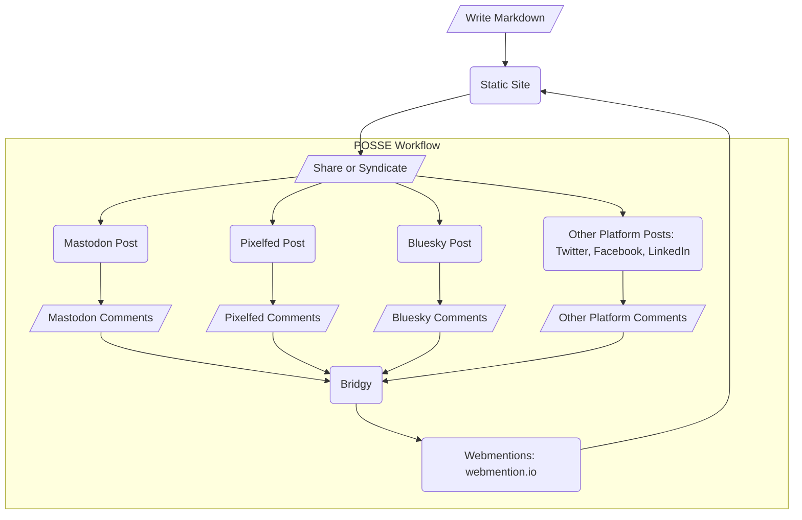

I signed up for Twitter back in 2007. It was a simpler time. It was a simpler
Twitter. I really enjoyed using the service and didn't mind gradually
contributing more and more content there. I became aware of the fact that this
came at the cost of making less regular updates to my own blog. I made peace
with that as I had more interesting conversations on Twitter than in the
comments of my blog. I didn't mind essentially trading RSS feeds for Twitter
lists. I traded ownership for convenience. Everything is a compromise and that
felt reasonable at the time.

Today, I'm evaluating that compromise and considering an alternative. I'm trying
to think of my personal site as less of a "blog" and more of a "[digital garden](https://maggieappleton.com/garden-history)".
That's a whole other post, but the significance here is: this has reduced
friction to writing for me and got me more excited to post than I've been in a
while. As I create more, I think more about workflow and tooling. I want _my
garden_ to be canonical and it looks like some smart people sorted out a
reasonable strategy for this by the name [POSSE](https://indieweb.org/posse) .

## One does not simply comment on a static site

Most dynamic content management systems ship with some sort of comment feature,
but that's less trivial to implement with a static site. There's a lot of ways
to handle this, but I want to lean into the
[Webmention](https://www.w3.org/TR/webmention/) recommendation.

> When you publish a post with links to other sites, your site can send a
> webmention notification to sites that accept them to inform them that they
> were linked to.
>
> A webmention receiver provides discovery of their webmention endpoint so it can
> be found by others who link to the page. When a receiver’s endpoint receives a
> webmention notification, it looks up the sender’s post and may display it as a
> response.
>
> Mentions mainly require a link to the recipient on the page, but they can be
> enhanced into more meaningful responses (such as comments, reposts, or likes)
> by adding microformats to the sender’s post.
>
> --[indieWeb.org](https://indieweb.org)

You could say there's still a compromise in that I don't "own the engagement".
But, as I stated, everything is a compromise and I think I like this compromise
better. I want to own my content, but I don't feel a need to own the
interactions with my content. Enabling readers to comment where they like and
aggregate that on my site feels like a reasonable thing to do.

## Ok, but what is POSSE!?

POSSE stands for "Publish (on your) Own Site, Syndicate Everywhere." The concept
is straightforward, but implementation can be a little tricky. In a nutshell
though, by opting into a few microformats, you can enrich the site you control
with engagement that occurs on platforms you don't.

### The POSSE Workflow as I understand it

This is getting a bit abstract, so I'll reign it in with some concrete examples.
At the moment, I'm enjoying publishing my content via
[Astro](https://astro.build/). Nothing about my workflow is unique to Astro, just
the implementation details. Once you have content available on the web, sharing
via a platform like Mastodon satisfies the "syndication" bit. Assuming you have
your site setup to consume Webmentions, you can use Bridgy to convert Mastodon
replies to webmentions that you can display on your own blog.

## Where do we go from here?

I'm currently folding ideas from this post into my blog. At the moment, I don't
have syndication automated. I'm cautious about appearing overly promotional as I
navigate this new approach. I've shared a couple posts to
[mastodon](https://mastodon.social/@RyanParsley/113082555966252676) and
[replies](https://mastodon.social/@RyanParsley/113082577656954796)
[prove](/note/webmentions) my workflow is functioning as intended.

If you find this useful, hit me up on
[Mastodon](https://mastodon.social/@RyanParsley) or
[bluesky](https://bsky.app/profile/ryanparsley.bsky.social). If I have something
wrong or you find a bug in my blog, I'd love to see it as an
[issue](https://github.com/RyanParsley/rpdc/issues/new).
