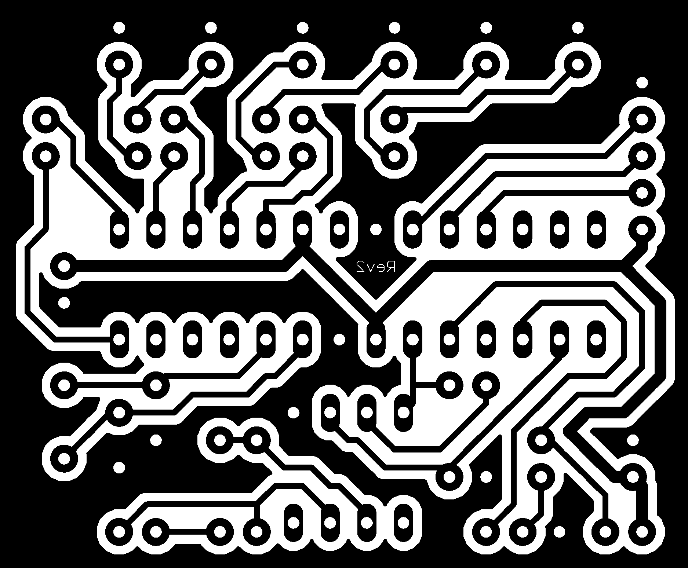
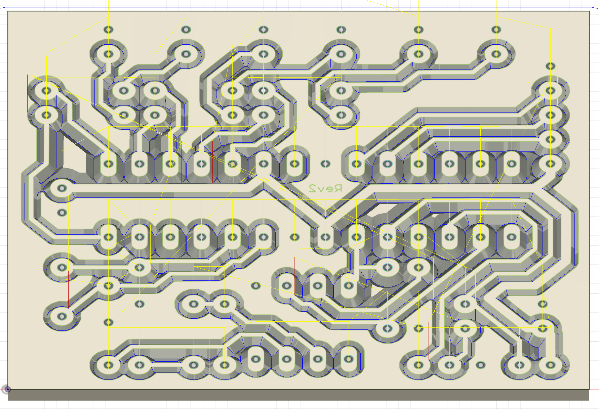
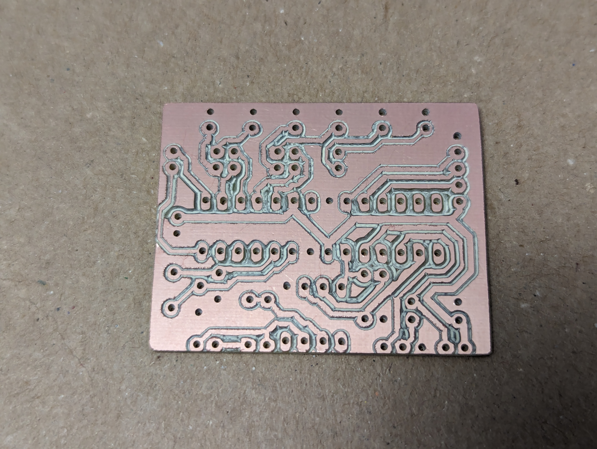
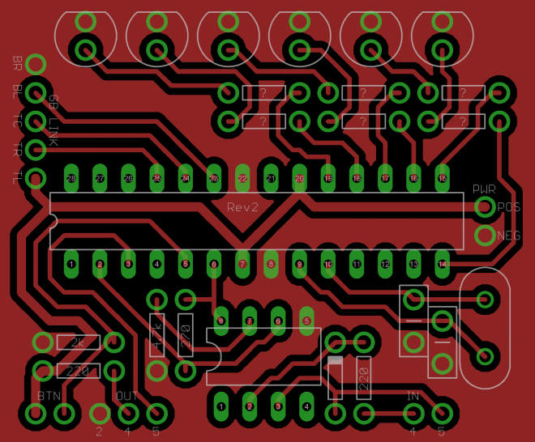
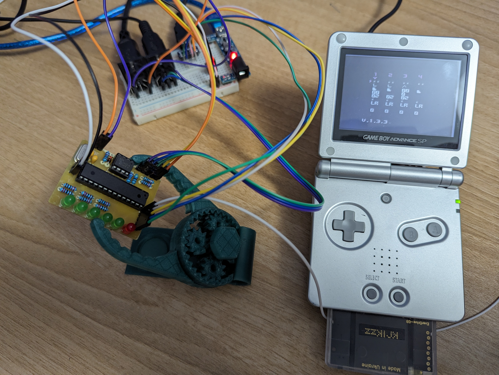
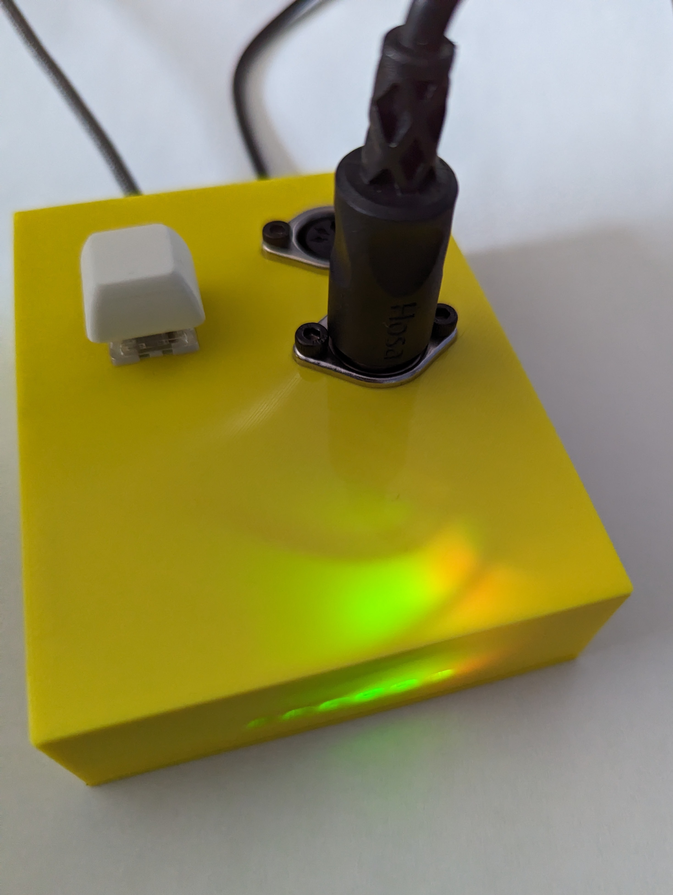
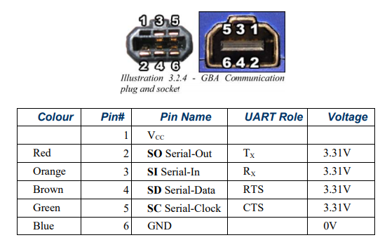
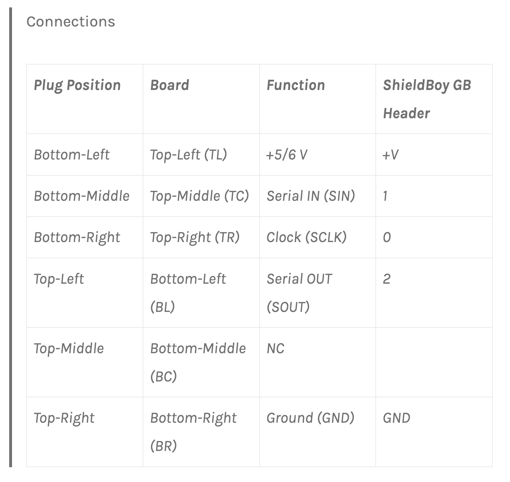

I stumbled upon a schematic in this [forum
post](https://chipmusic.org/forums/post/202844/#p202844) by way of [this blog
post](https://gr33nonline.wordpress.com/2019/04/06/making-your-own-arduinoboy/).
While a PNG is not the most convenient way to express a circuit, but I'm glad to have
found it.

## PNG -> SVG -> CAD

I opened the PNG in inkscape and traced it as a vector. From there, I
exported an SVG to import into Fusion 360.

## Milled this

Once I had that sorted out, I sent it over to my [MPCNC](/note/mpcnc) for
milling.

## Time to solder

Following this image, I soldered it up.

To avoid damaging the link cable, I ordered up a [breakout PCB](https://github.com/Palmr/gb-link-cable).

## It's Alive

Here is a shot of my custom PCB wired up to my Game Boy Advance SP.

## In a slick Enclosure

And here it is all finished up in a [custom
enclosure](https://www.printables.com/model/783225-arduinoboy-enclosure) I
designed.

## Parts

- [Everdrive GB x5](https://amzn.to/4fd8AX4)
- [Everdrive GBA x5](https://amzn.to/3Weubpd)
- [Anbernic RG351V](https://amzn.to/3ykx5AO)
- [Link Cable](https://amzn.to/3LGCW6x)
- [GBA Link Cable](https://amzn.to/3Lxoxts)
- [GBA Headphone Dongle](https://amzn.to/3Lxoxts)
- [Copper blank for PCB](https://amzn.to/4d9T5NK)

Note about your Everdrive choice, LSDJ is a Game Boy game, not GBA. If you go
with the GBA, there is an emulator and you can use LSDJ through emulation.
However, there's a big but there. Saving songs doesn't work in LSDJ through
emulation. I own both and use them in different contexts. For the smoothest
LSDJ experience, buy the Game Boy version. If you're looking to play with
Stepper, that's a Game Boy Advanced game so you'll need the GBA Everdrive.

## Board Dimensions

1.875 x 1.55 in.

## Link cable schematics

[source](https://github.com/afska/gba-remote-play)

> Really you only need 3 wires: Gound, Clock, and Data Input.
> <https://forum.arduino.cc/t/arduino-gameboy-midi-communication/7151/4>

Looks like clock is missing by design on GBA link cables.

## Timeline

- 2024-02-12 Milled
- 2024-02-15 Soldered
- 2024-02-21 Functioning
- 2024-02-26 In an Enclosure

## Resources

- <https://github.com/aleh/LSDJmi>
- <https://chipmusic.org/forums/topic/13608/dmg-main-board-schematic-circuit-arduinoboy/>
- <https://chipmusic.org/forums/post/202844/#p202844>
- <https://gr33nonline.wordpress.com/2019/06/11/arduinoboy-build/>
- <https://gr33nonline.wordpress.com/2023/05/29/more-arduinoboy-and-genius-fix-schematics-and-pcb-masks-again/>
- <https://gr33nonline.wordpress.com/2019/04/06/making-your-own-arduinoboy/>
- <https://github.com/greenonline/ArduinoBoy_GeniusFix>
- <https://gr33nonline.wordpress.com/2019/03/23/arduinoboys-and-others/>
- <https://gr33nonline.wordpress.com/2019/03/26/scaling-pdf-for-pcb/>
- <https://imgur.com/tjAVc6L>
- <https://gr33nonline.wordpress.com/2023/05/30/making-a-gerber-from-a-pdf/>
- <http://www.mksmks.de/technical/gbmtocube.htm>
- <https://user-images.githubusercontent.com/1631752/124884342-8ee7fc80-dfa8-11eb-9bd2-4741a4b9acc6.png>
- <https://www.instructables.com/Build-an-ArduinoBoy/>
- <https://imgur.com/MybMnTU>
- <https://github.com/trash80/Arduinoboy>
- <https://github.com/trash80/Arduinoboy/blob/master/Schematic/arduinoboy_schematic_1_1_0.png>
- <https://www.instructables.com/Build-an-ArduinoBoy/>
- <https://github.com/greenonline/ArduinoBoy_GeniusFix>
- <https://palmr.co.uk/posts/26-gameboy-link-cable-breakout/>
