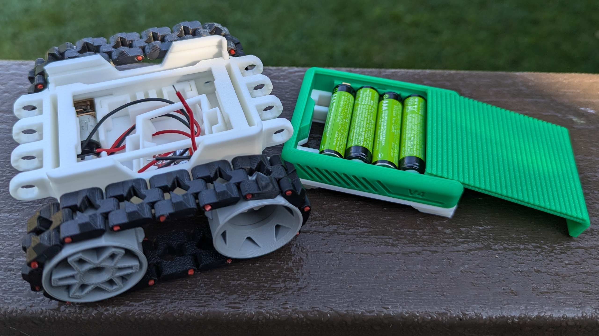
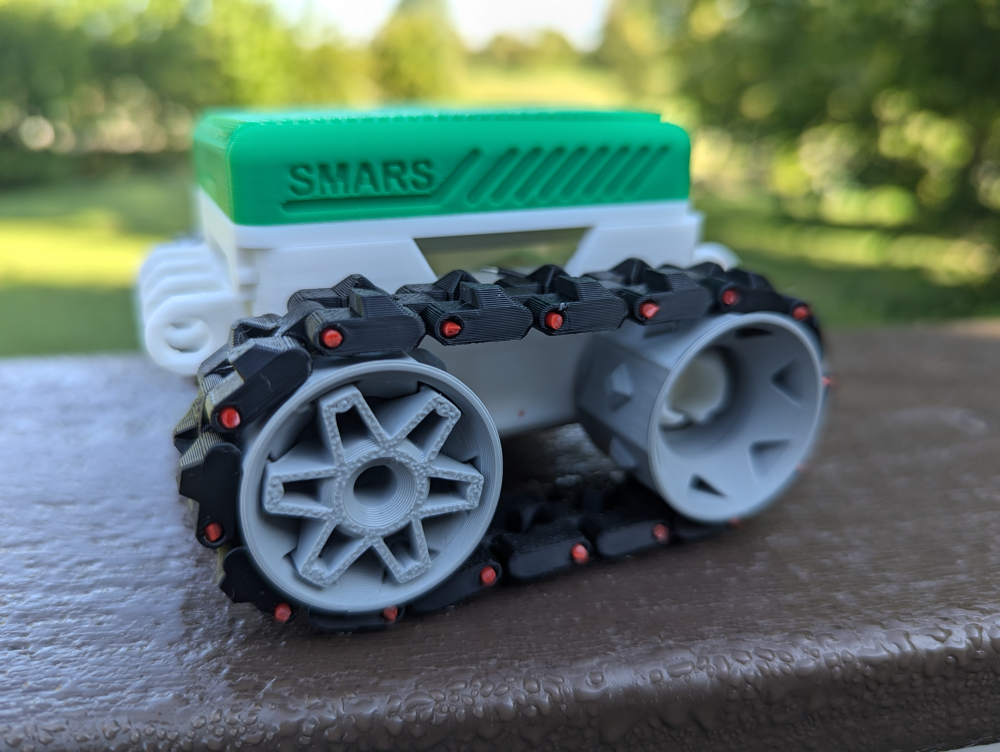

I came about the SMARS (Screwless Modular Assembleable Robotic System) by way of
[Kevin McAleer](https://www.smarsfan.com/), but the creator is Kevin Thomas.
Thomas shares his [original
designs](https://www.thingiverse.com/thing:2662828)as Noncommercial Creative
Commons and sells newer iterations like the
[V4](https://cults3d.com/en/3d-model/gadget/smars-v4), [V4
Lite](https://cults3d.com/en/3d-model/gadget/smars-v4-lite) and
[M1](https://cults3d.com/en/3d-model/gadget/smars-m1-set) to support further
iterations. I bought the V4 initially and bought the V4 Lite before I could even
finish my first build because it was so fun to work with. If you're in a hurry,
you can get all the parts you need in a couple of days from Amazon for about $43
dollars. If you're more patient, you can beat that price by a bit shopping on
AliExpress.

## V4

The modular nature leaves you open to configure the robots in any way you can
imagine, but there are 2 main trajectories the official documentation nudge you
towards. The first option being based around the Arduino Uno and the second
around an Arduino Nano seated in a breakout board. Since many of the parts come
in 3-5 packs, I ended up exploring both options right off the bat.

### Uno

The design based around the Arduino Uno felt simpler to build and is more open
to further experimenting. If you don't already have parts or an opinion to the
contrary, I'd recommend starting with this design. There was only 2 tricky parts
to this build.

The first issue I encountered was the middle battery pack design is a little
fussy and the instructions are minimal to the point of not helping with this.
You want to solder your wires wires towards the top of the brass fittings so the
bulk pushes the batteries down. This matters more than I assumed. My first
attempt at this, I soldered at the bottom and the batteries didn't want to stay
in place.

Other than that issue, it more or less just came together. The second tricky bit
was also around the power supply. In order to wire power to the microcontroller
and the motor driver, you'll need to splice a few wires together. Doing so such
that all the wires can fit in the space allowed took me a few tries. The
circuit diagram gives you all the information that you need, but be mindful that
you don't want too much extra wire to deal with.

### Nano

This design looks more polished due to it's enclosed nature, but that comes at
a cost. It's much more fussy in how things have to come together and be able to
get it all closed up. The recommended terminal option was out of stock so I got
a slightly different one that was available on Amazon. It didn't fit in the
case.

With the break out board I purchased, there were 2 problems. First, it was a
touch wider and didn't fit in the printed holder. Second, and this was the
doosie, it came with the headers pre installed. That sounded like a good thing
when I ordered it, troubleshooting the fit, it wasn't. Turns out the chassis
design assumes you don't use headers and this extra height was why i couldn't
close the case. Desoldering these are not my idea of a good time, so I ordered a
replacement set that's not pre-soldered.

When I saw the breakout board, I thought this was going to allow me to swap out
various nano profile microcontrollers in the same robot easily. Needing to
solder it to the be breakout board limits this quite a bit. Uno profile boards
are about the same cost as the nano size and once you mount the nano to a
breakout it's not much smaller than the Uno. Dedicating a nano like this is kind
of a bummer, but I still plan to finish one robot of this design because it
looks pretty cool.

## V4 Lite

I'm making a third robot at the same time with this similar but different
chassis design. I like 2 design characteristics of the lite that I wanted to
work with. First, I like how the treads are replaced with silicone bracelets.
That seems like a fun and cheap way to get better traction. Secondly, I liked
the look of the raspberry pi adapter.

### Motor Hat

I have a Raspberry Pi hat called the Adafruit Crickit that does tons of stuff
including drive motors. The hat need 8mm of spacers between it and the Pi. I had
a 6mm standoff and used a 2mm washer, but 8mm standoff would be simpler.

#### Todo

It looks like the Adafruit Crickit hat has power demands such that I can't turn
the pi on with the hat on. I have a power cord coming to account for that.

## Parts Overview

### Microcontrollers

- Uno R4 Wifi (esp32) $28 <https://amzn.to/3STv4Tq>
- Nano are about $5 <https://amzn.to/4dIBEol>
  - Add bluetooth to an Arduino for $8 <https://amzn.to/3X88k4z>
- Nano shaped ESP32 with wifi (ESP32-S3-Nano) is $13 <https://amzn.to/3AGk05C>
- Arduino Nano RP2040 Connect with Headers $30 <https://amzn.to/3yyYShn>

### Motors

- Motors about $7 for the pair <https://amzn.to/3Tifktx>
- Motor driver $1.5 <https://amzn.to/4dQEYNt>

### Sensors

- HC-SR04 Ultrasonic Module Distance Sensor $2 <https://amzn.to/3Xakw4X>
- IR Sensor $3 <https://amzn.to/3yzKTb3>

### Accessories

- Nano Terminals $2 <https://amzn.to/3WYw2PE>
- LEDs $11 <https://amzn.to/3X8oFpO>
- Power Switch $0.50 <https://amzn.to/3YQWFIH>
- Prong Fasteners
- Servos $2 <https://amzn.to/3XcL2e4>
- Servos metal gears $3.50 <https://amzn.to/4fJD2IF>

### V4 Lite Parts

- Bracelets $1 <https://amzn.to/4dROCQh>
- Bearings $26 <https://amzn.to/3X990Xl> and <https://amzn.to/3X88XuX>
- Battery $12 <https://amzn.to/3X88XuX> and connector <https://amzn.to/3XcL2e4>

## V4 Price

| Part              |  Price |
| ----------------- | -----: |
| Arduino R4        | $28.00 |
| motors and shield |  $8.50 |
| distance sensor   |  $2.00 |
| servos            |  $4.00 |
| power switch      |  $0.50 |
| Total             | $43.00 |
