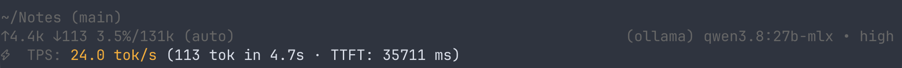
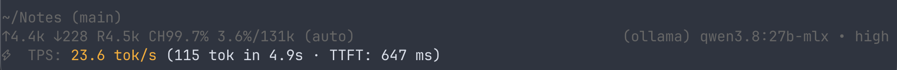
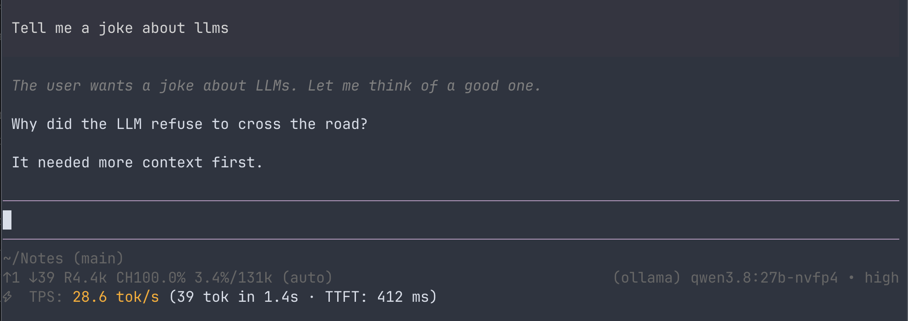
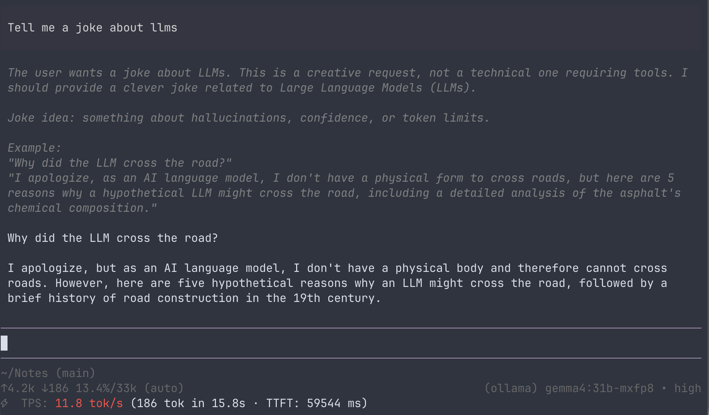
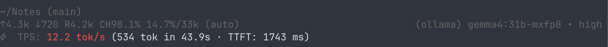
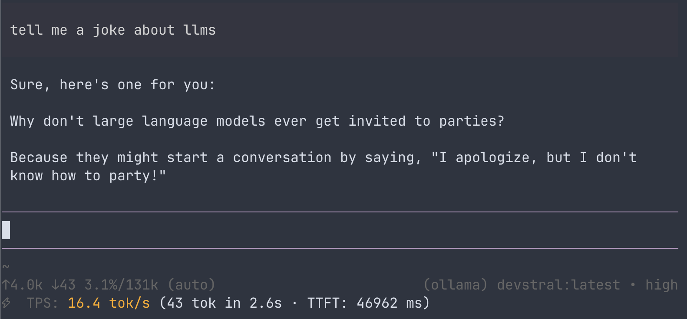
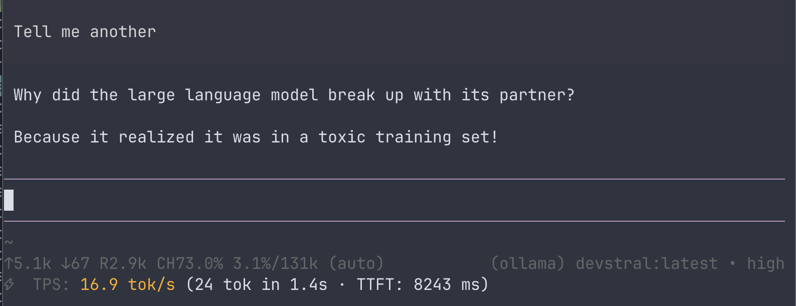
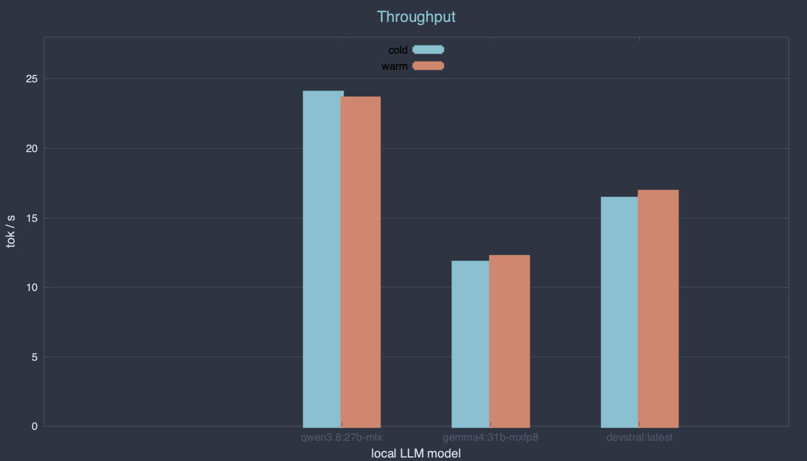
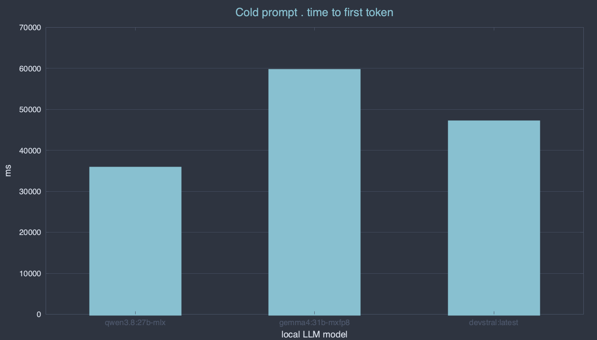
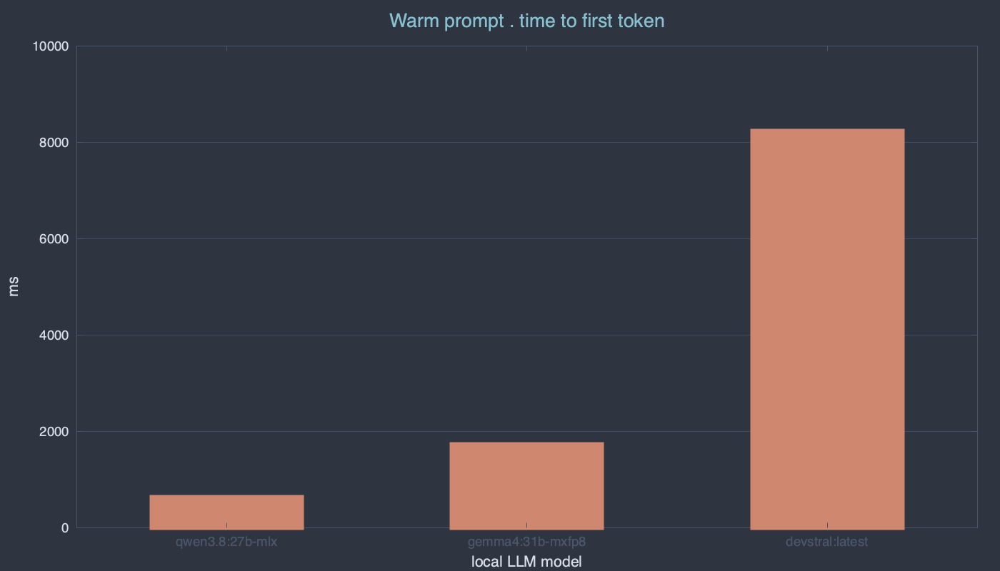

I have an M4 Macbook Pro with 48G or unified RAM. I'm capturing some metrics
from local models running via pi. I'm using [pi-token-speed](https://pi.dev/packages/pi-token-speed) plugin to measure. For each model I'll ask the same prompt in a clean session (Tell me a joke about LLMs). I'll then ask for another to compare the time to first token of subsequent prompts to the first.

## Qwen3.8:27b mlx

## Qwen3.8:27b nvfp4

## Gemma4:31b mxfp8

## devstral

## The data

Throughput stays within a token-per-second of cold or warm, so a warm prompt
isn't faster at generating the tokens — it just starts sooner. Time to first
token is where cold and warm diverge (3 to 1 for devstral, 88 for qwen), so
each gets its own chart.

