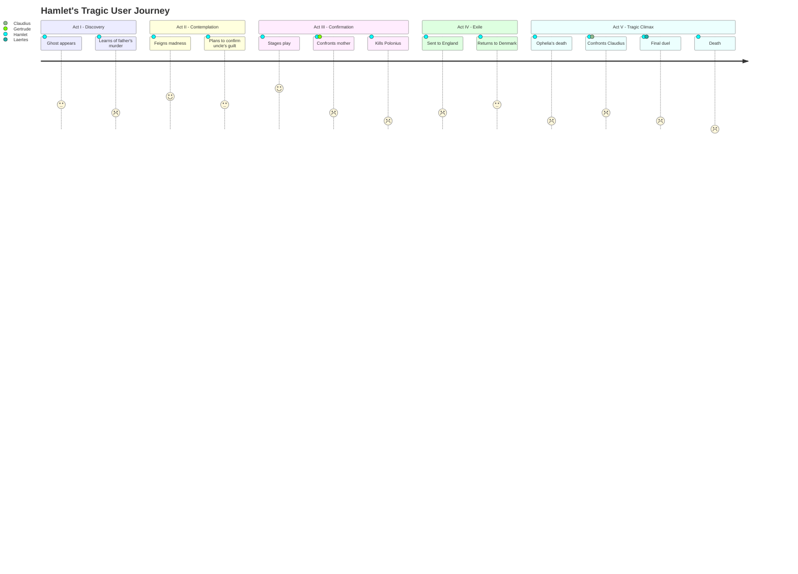

```mermaid
journey
    title Hamlet's Tragic User Journey
    section Act I - Discovery
      Ghost appears: 3: Hamlet
      Learns of father's murder: 2: Hamlet
    section Act II - Contemplation
      Feigns madness: 4: Hamlet
      Plans to confirm uncle's guilt: 3: Hamlet
    section Act III - Confirmation
      Stages play: 5: Hamlet
      Confronts mother: 2: Hamlet, Gertrude
      Kills Polonius: 1: Hamlet
    section Act IV - Exile
      Sent to England: 2: Hamlet
      Returns to Denmark: 3: Hamlet
    section Act V - Tragic Climax
      Ophelia's death: 1: Hamlet
      Confronts Claudius: 2: Hamlet, Claudius
      Final duel: 1: Hamlet, Laertes
      Death: 0: Hamlet
```