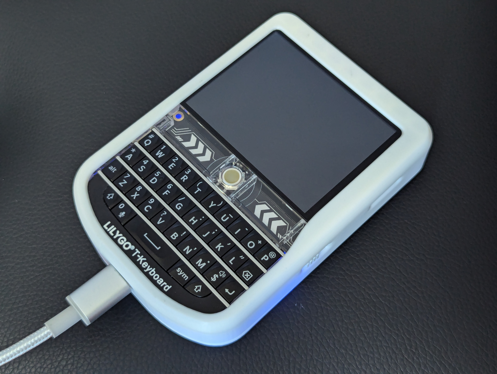

I picked up a [LILYGO T-Deck](https://amzn.to/3SAIfZ6) a while back and it is
pretty feature packed for it's price but one noticeable feature is missing out of
the box. Namely, GPS. Location seems pretty integral to the mesthastic
experience. For other Meshtastic devices, it makes sense to share your phone's
GPS with other units, but the T-Deck is meant to be stand alone and

## Inspiration

Inspired by [this youtube
video](https://www.youtube.com/watch?v=sNMCQYCeJcU) I set out to add an
[HGLRC Mini M100 GPS Module](https://amzn.to/4ckvZTI) to my
T-deck.

## Issue

The video does a good job showing you how to hook up the hardware, but doesn't
mention a key detail that tripped me up. After you wire up the module, you need
to adjust a setting in the software so the unit will even try to use your new
GPS module.

## Solution

With your device ready to be paired with a computer visit
https://client.meshtastic.org/ and connect. Once you see your T-Deck, navigate
to `config` and select the `position` tab. Under `Position Settings` you'll
find GPS Mode. Select `Enabled` and hit save. After your device reboots you
should be good to go.
