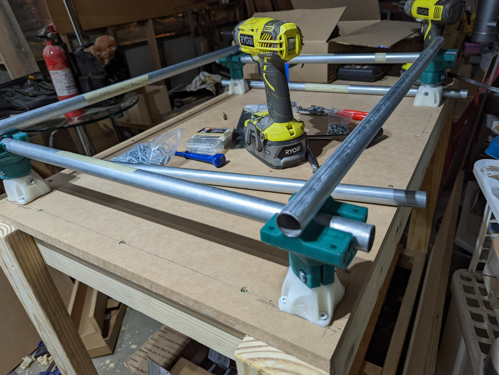
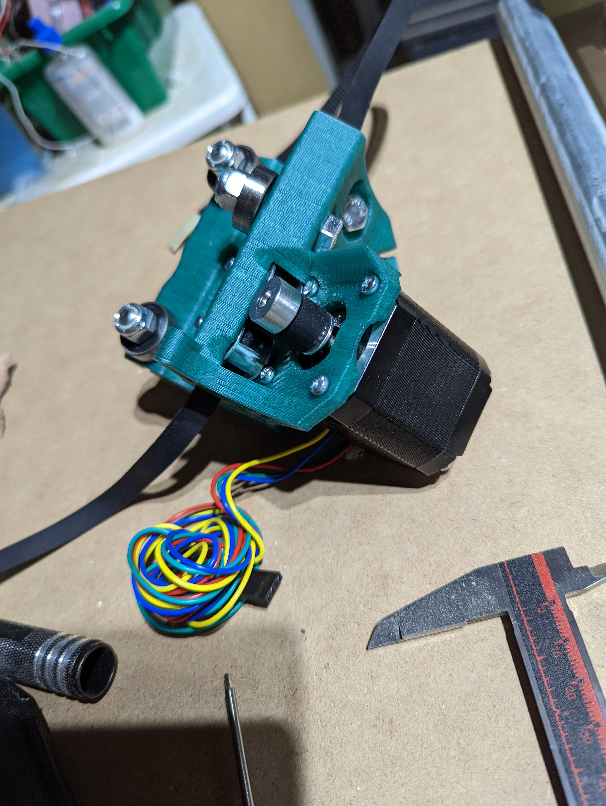
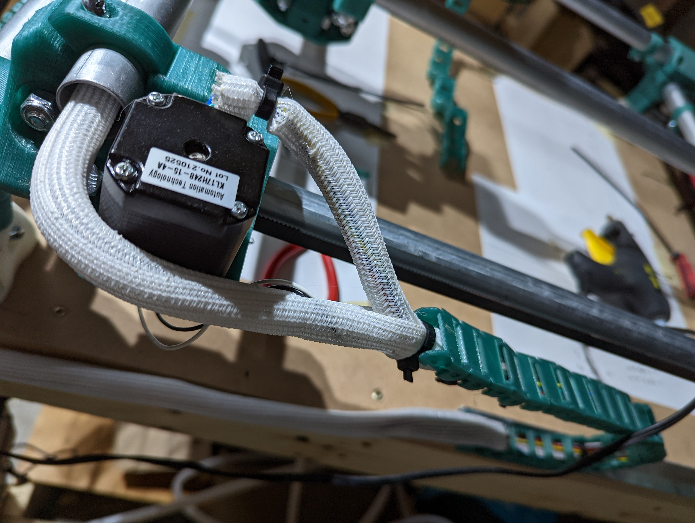
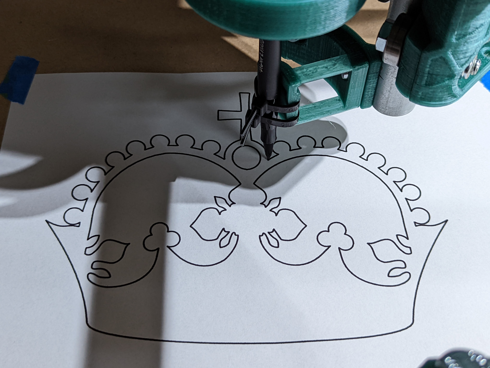

## Log

- 2022-07-30
  - Order the kit, start printing and go to home depo for pipes.
- 2022-08-01
  - Cut pipes to size
- 2022-08-03
  - Buy lumber for the table and mostly assemble it.
- 2022-08-04
  - Receive kit and finish printing of required parts.
- 2022-08-05
  - Finish table assembly and level the top. File legs to dimension and round over edges.
- 2022-08-06
  - Begin base assembly. File additional rails.
- 2022-08-14
  - Successful drawing of a complicated crown illustration with a felt tip pen.
- 2022-08-15
  - repair stop connection and put in a router.

## Details

### Finish table assembly and level the top

### Base Assembly

### Belt Assembly

### Cable Management

### Successful Drawing

## Tools that came in handy

- [VINCA Digital Caliper](https://amzn.to/4cbyoQr)
  - These are pretty cheap and get the job done
- [Stanley 33-231 Powerlock Tape Measure](https://amzn.to/4fuHNFO)
  - I love this tape measure so much I bought a second one. Metric and Imperial
    on the same small(ish) tape measure is great working in metric if you mostly
    think in inches.
- [1/2 inch Cord Protector Tubing](https://amzn.to/4dsTtHo)
- [Hex Drivers](https://amzn.to/4fxujJu)
